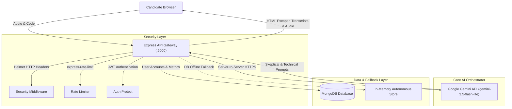

<div align="center">

# ⚡ HireReady
### **Voice-First AI Technical & Behavioral Interview Simulation Platform**

*Simulate hyper-realistic engineering interview loops before stepping into the room.*

---

[](https://thefifthbit.onrender.com)
[](https://ai.google.dev/)
[](https://nodejs.org)
[](#-security--white-box-audit)
[](LICENSE)

<br/>

[🚀 **Launch Live Platform**](https://thefifthbit.onrender.com) &nbsp;•&nbsp;
[⚡ **Quickstart Guide**](#-quickstart-guide) &nbsp;•&nbsp;
[🎯 **Mission Calibration**](#1--mission-calibration-pre-interview-setup-modal) &nbsp;•&nbsp;
[💻 **Code Sandbox**](#3--live-coding-sandbox--algorithmic-auditor) &nbsp;•&nbsp;
[🔒 **Security Architecture**](#-security--white-box-audit)

<br/>

```
  ____ ___  _  ___ _____ _   _   ____ ___ _____ 
 / ___/ _ \| |/ / |_   _| | | | | __ )_ _|_   _|
 \___| | | | ' /| | | | | |_| | |  _ \| |  | |  
  ___) | |_| . \| | | | |  _  | | |_) | |  | |  
 |____/\___/|_|\_\_| |_| |_| |_| |____/___| |_|  PRESENTS: HIREREADY
```

</div>

---

> [!IMPORTANT]
> **What makes HireReady different?**  
> Traditional mock interview tools rely on static multiple-choice questions or pre-recorded generic bots. HireReady operates as an **active, listening technical interviewer** powered by Google Gemini. It parses your spoken architecture explanations, detects hesitation fillers (`um`, `like`), inspects your real-time code submissions for $O(N)$ algorithmic complexity, and actively stress-tests your design assumptions.

---

## 📸 Platform Experience

| Mission Setup | Live Room & Orbital HUD | Live Code Sandbox |
| :---: | :---: | :---: |
| Pre-flight modal calibrating role, difficulty & rounds | Real-time speech synthesis, audio waveforms & WPM | Multi-language IDE with direct AI complexity review |
| `🎙️ Verbal` vs `💻 Code` | `⚡ Pressure Mode Toggle` | `Python`, `JS`, `C++`, `Java`, `Go` |

---

## 🌟 Core Features

### 1. 🎯 Mission Calibration (Pre-Interview Setup Modal)
No surprise starts. Opening the interview room triggers a mission calibration overlay allowing you to tune every dimension of the simulation:

```
+------------------------------------------------------------------+
|                   MISSION CALIBRATION // HR-1                    |
+------------------------------------------------------------------+
| 01 // SESSION TYPE      [🎙️ Verbal Interview]  [💻 Code Sandbox] |
| 02 // TARGET ROLE       [Software Engineer II (SDE-2)         v] |
| 03 // DIFFICULTY        [ Easy ]  [ Medium (Active) ]  [ Hard ]  |
| 04 // INTERVIEW ROUND   [System Architecture & Scalability    v] |
| 05 // PRESSURE PROTOCOL [⚡ High-Pressure Stress Test: [ON / OFF]]|
+------------------------------------------------------------------+
```

- **9 Specialized Roles:** SDE-2, Senior SDE / Lead, Staff Distributed Architect, Frontend Engineer, Backend Systems Engineer, Full Stack Generalist, AI/ML Research Engineer, DevOps/SRE, and Technical Product Manager.
- **Difficulty Calibration:** Foundational (0-2 Yrs), Production (2-5 Yrs), and Staff/Principal (5+ Yrs).
- **Multi-Round Tracks:** System Architecture, Data Structures & Algorithms, Behavioral (STAR Method), and Full-Loop Comprehensive.

---

### 2. ⚡ Standard Mode vs. ⚡ Pressure Mode

HireReady features two distinct interviewer personas that can be switched on the fly:

| Capability | 🟢 Standard Mode | ⚡ Pressure Mode (Stress Testing) |
| :--- | :--- | :--- |
| **Interviewer Persona** | Supportive, conversational, guiding | Skeptical, rigorous, highly demanding |
| **Interruption Frequency** | Low (allows full uninterrupted thought) | High (interrupts verbosity and vague answers) |
| **Assumption Scrutiny** | Accepts reasonable design premises | Actively challenges choices (*"That won't scale past 20k QPS—why not X?"*) |
| **Time Constraints** | Relaxed, standard interview pacing | Strict time budgets (*"You have 45 seconds to justify this tradeoff"*) |
| **Target Audience** | Building baseline confidence & STAR structure | Senior/Staff stress testing & high-stakes FAANG preparation |

---

### 3. 💻 Live Coding Sandbox & Algorithmic Auditor
Switch seamlessly between verbal discussion and the live code sandbox:
- **Supported Languages:** Python 3, JavaScript (ES6), C++ (20), Java 17, and Go 1.22.
- **One-Click Critique (`⚡ Submit Code for AI Critique`):**
  - Evaluates both **Time Complexity** (e.g., $O(N)$, $O(N \log N)$) and **Space Complexity** ($O(1)$, $O(N)$).
  - Identifies hidden edge cases (integer overflow, deadlocks, partition splits, hash collisions).
  - Prompts immediate architectural follow-ups based on your submitted code.

---

### 4. 🎙️ Voice-First Telemetry Engine
- Native browser **Web Speech API** integration for bidirectional, zero-latency speech-to-text recognition and natural speech synthesis.
- **Orbital Audio Waveform:** Multi-harmonic pulsing visualizer reacting dynamically to audio cadence.
- **Pace Analysis:** Instantaneous Words Per Minute (WPM) tracking with target rate indicators.
- **Filler Word Detection:** Real-time extraction and telemetry logging of verbal crutches (`um`, `uh`, `like`, `basically`, `actually`, `literally`, `you know`).

---

### 5. 🛡️ Session Integrity & Anti-Cheat Heuristics
- **Tab Focus Tracking:** Monitors candidate window blur/focus events to ensure interview authenticity.
- **Paste Event Telemetry:** Detects sudden mass clipboard insertions in the code editor.
- **Session Duration:** Live stopwatch logging timestamped transitions.

---

## 🏛️ System Architecture



---

## 🔒 Security & White-Box Audit

A comprehensive application security audit was performed on the codebase:

| Security Dimension | Audit Result | Architectural Defense |
| :--- | :---: | :--- |
| **Client-Side Secret Leaks** | **PASS (Clean)** | Zero upstream keys (`GEMINI_API_KEY`) exist in client JS, HTML, or CSS bundles. |
| **Backend Isolation** | **PASS (Isolated)** | All LLM API calls are strictly routed server-to-server. Upstream keys never touch the client. |
| **Environment Management** | **HARDENED** | Dual-tier `.gitignore` at both repository root and workspace directories prevents `.env` leaks. |
| **Git Commit History** | **PASS (Clean)** | Full commit history verified clean; no cached secrets or staging artifacts. |
| **XSS & Injection Protection**| **PASS (Sanitized)** | Transcript rendering escapes raw HTML entities (`&`, `<`, `>`, `"`, `'`). |
| **IDOR Access Controls** | **PASS (Verified)** | Evaluation reports verify session ownership against `req.user.id`. |

---

## 📂 Repository Layout

```
hire-ready/
|-- .gitignore                          # Repository root secret exclusions
|-- README.md                           # Master documentation
+-- ai interview trainer/
    |-- .gitignore                      # Subfolder environment exclusions
    |-- backend/
    |   |-- middleware/
    |   |   +-- auth.js                 # JWT verification & tenant isolation
    |   |-- models/
    |   |   |-- User.js                 # Candidate profile schema
    |   |   +-- Session.js              # Multi-turn interview & score schema
    |   |-- routes/
    |   |   |-- auth.js                 # Register, login, session validation
    |   |   |-- interview.js            # Gemini AI proxy, prompt engine, pressure mode
    |   |   |-- evaluation.js           # Score generation & metrics calculation
    |   |   |-- leaderboard.js          # Peer matrix percentile rankings
    |   |   |-- resources.js            # Curated interview learning modules
    |   |   +-- users.js                # Profile parameters & settings sync
    |   |-- server.js                   # Node Express server
    |   +-- package.json
    +-- frontend/
        |-- index.html                  # Cosmic landing page & interactive console
        |-- css/
        |   +-- main.css                # Obsidian & starlight design system
        |-- js/
        |   +-- api.js                  # Frontend API client & toast notifications
        +-- pages/
            |-- dashboard.html          # Performance dashboard & readiness gauge
            |-- interview.html          # Simulation room (Orb, Sandbox, Setup Modal)
            |-- evaluation.html         # In-depth performance scorecard
            |-- leaderboard.html        # Global rankings
            |-- resources.html          # Technical preparation guides
            |-- settings.html           # Calibration & preference parameters
            |-- login.html              # Candidate sign-in
            +-- register.html           # New enrollment
```

---

## ⚡ Quickstart Guide

### Prerequisites
- **[Node.js](https://nodejs.org/)** v18 or higher
- **[Google Gemini API Key](https://aistudio.google.com/app/apikey)** (Free tier supported)
- **MongoDB** *(Optional -- includes an automated in-memory demo engine if MongoDB is not installed)*

### 1. Clone & Navigate
```bash
git clone https://github.com/Sayan-stg/hire-ready.git
cd hire-ready/"ai interview trainer"/backend
```

### 2. Install Dependencies
```bash
npm install
```

### 3. Create Environment Configuration
Create a `.env` file inside `ai interview trainer/backend/`:

```env
PORT=5000
NODE_ENV=development
JWT_SECRET=your_long_random_jwt_secret_here
GEMINI_API_KEY=your_google_gemini_api_key_here
MONGODB_URI=mongodb://localhost:27017/hireready
```

> [!TIP]
> **Zero Database Setup Needed for Testing:**  
> If you do not have MongoDB running, the server will automatically start in **Autonomous In-Memory Demo Mode**. You can test the complete AI simulation immediately!

### 4. Launch the Server
```bash
node server.js
```

### 5. Access the Platform
Visit **[http://localhost:5000](http://localhost:5000)** in Chrome, Edge, or Safari.

---

## 🛠️ Technology Stack

| Ecosystem | Technology | Purpose |
| :--- | :--- | :--- |
| **AI Intelligence** | Google Gemini (`gemini-3.5-flash-lite`) | Natural technical dialogue, critique, and high-pressure probing |
| **Speech Processing**| Web Speech API (`SpeechRecognition`, `speechSynthesis`) | Client-side native audio transcription and natural voice readout |
| **Backend Runtime** | Node.js & Express.js | High-throughput REST API gateway & upstream security proxy |
| **Security Suite** | Helmet, express-rate-limit, bcryptjs, jsonwebtoken | Attack surface reduction, DDoS mitigation, and credential encryption |
| **Data Layer** | MongoDB & Mongoose | Persistent storage with fallback in-memory cache |
| **Design System** | Custom CSS3 (Obsidian & Starlight Glassmorphism) | Ultra-fast vanilla architecture with zero bulky framework overhead |

---

## 👥 Authors & Team

Crafted with dedication by **Sixth Bit**:
- **Sayan** -- [*GitHub Profile*](https://github.com/Sayan-stg)
- **Adeet Singh** -- [*GitHub Profile*](https://github.com/adeetsingh)

---

## 📄 License

This repository is distributed under the **MIT License**. See the [LICENSE](LICENSE) file for more information.

<div align="center">
  <sub>Engineered with precision for ambitious software engineers worldwide. Star us on GitHub if you found this helpful!</sub>
</div>